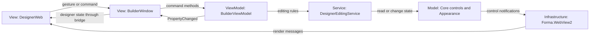

# Forma architecture

Forma uses a layered architecture with an incremental MVVM implementation in the Builder: a C# control model, a WebView2 rendering adapter, and a browser-based designer view. The boundaries below describe the existing code and the direction for future refactoring.

## Existing layers

| Layer | Responsibility | Examples |
| --- | --- | --- |
| Core | Control state, validation, parent/child relationships, events, rendering contracts | `Control`, `NumericControl`, `IRenderer`, `IBridge` |
| WebView2 | Translate model updates into browser messages and browser interactions into model events; render controls in the DOM | `WebView2Renderer`, `WebView2Bridge`, `forma.js` |
| Builder view model and editing service | Form, selection, appearance, preview state, project identity, dirty/title notifications, document creation/application, editing rules, and history commands | `BuilderViewModel`, `DesignerEditingService` |
| Builder view and services | Native window integration, bridge dispatch, rendering, inspector descriptors, and project persistence | `BuilderWindow`, `InspectorCatalog`, `ProjectFile` |
| Designer browser UI | Toolbox, inspector editors, drag/resize gestures, alignment guides, and preview interaction | `designer.js`, generated Tailwind styles |

Core must remain independent of WinForms, WebView2, DOM, CSS, and native file dialogs. Renderer interfaces provide a boundary for a different rendering implementation. Browser gestures send commands to the C# host, where authoritative control state and validation live; the browser keeps transient interaction state.

The control tree follows the **Composite** pattern: controls contain child controls. Property notifications and control events follow the **Observer** pattern. The renderer and bridge form an **adapter** between C# models and the browser. These describe specific parts of the code, not a claim that the whole application already follows one formal pattern.

## Current folder structure and MVVM roles

This is the current source layout, with representative control files shown. Build output, dependencies, and individual icon files are omitted.

```text
Forma/
├── src/
│   ├── Forma.Core/                         Model and framework contracts
│   │   ├── Form.cs                         Root of the control tree
│   │   ├── Controls/                       One control/supporting type per file
│   │   │   ├── Control.cs                  Shared state, children, notifications
│   │   │   ├── NumericControl.cs           Shared numeric behavior
│   │   │   ├── Button.cs
│   │   │   └── TextBox.cs                  Other controls live alongside these
│   │   ├── Events/                         Framework input event arguments
│   │   └── Rendering/                      Renderer and bridge interfaces
│   ├── Forma.WebView2/                     Rendering infrastructure
│   │   ├── WebView2Renderer.cs             Model-to-browser rendering adapter
│   │   ├── WebView2Bridge.cs               Browser message transport
│   │   └── Web/                            Framework runtime view assets
│   │       ├── index.html
│   │       ├── scripts/forma.js
│   │       └── css/forma.css
│   ├── Forma.Builder/                      Designer application
│   │   ├── Program.cs                     Application entry point
│   │   ├── Models/
│   │   │   ├── Appearance.cs              Designer-specific Model data
│   │   │   └── DesignerEditResult.cs      Edit feedback for the View
│   │   ├── ViewModels/
│   │   │   └── BuilderViewModel.cs        Designer state and edit/history commands
│   │   ├── Views/
│   │   │   └── BuilderWindow.cs           Native View and bridge integration
│   │   ├── Services/
│   │   │   ├── DesignerEditingService.cs  Add/delete/move/resize/property/layer rules
│   │   │   ├── DesignHistory.cs           Undo/redo support service
│   │   │   ├── ProjectFile.cs             Persistence service and file DTOs
│   │   │   └── InspectorCatalog.cs        Inspector property descriptors
│   │   ├── DesignerWeb/                   Browser portion of the View
│   │   │   ├── index.html
│   │   │   ├── designer.js
│   │   │   ├── designer.css               Generated stylesheet
│   │   │   └── icons/                     Local SVG assets
│   │   └── Frontend/                      View asset build tooling
│   │       ├── input.css                  Tailwind source
│   │       ├── build.cjs
│   │       └── package.json
│   └── Forma.Demo/                         Example consumer of the framework
├── tests/
│   ├── Forma.Tests/                       Model, ViewModel, service/renderer tests
│   └── WebRuntime/                        Browser runtime and designer DOM tests
└── docs/                                  Architecture, behavior, and roadmap
```

**Model:** `Forma.Core` contains reusable control state and rules. Builder-specific data such as `Appearance` stays in `Forma.Builder`, because the framework does not need to know how the designer stores styling. `Rendering/` contains infrastructure contracts, so not every file in Core is an MVVM Model.

**ViewModel:** `BuilderViewModel.cs` exposes the designer's state, notifications, and history command methods. It coordinates model data without referencing the native window or browser. Future inspector and toolbox view models belong to the Builder application too.

**View:** `BuilderWindow.cs` and `DesignerWeb/` together present the designer. The window hosts WebView2 and native dialogs; browser assets display controls and capture gestures. `Forma.WebView2/Web/` supplies reusable control rendering beneath that designer View. `Frontend/` builds the View's assets and contains no application state.

**Services and infrastructure:** `DesignerEditingService`, `DesignHistory`, `ProjectFile`, `InspectorCatalog`, and the WebView2 adapter support these roles. The editing service owns control creation, bounds, property validation, deletion, and layer ordering; the view model wraps editing batches in history tracking. MVVM does not require every helper or project to be classified as Model, View, or ViewModel.

### How an interaction crosses these folders



For example, moving a button travels from `designer.js` through `BuilderWindow` to `BuilderViewModel.ExecuteEdit()`. The view model captures history, calls the editing service to validate and clamp the position, and records the result. The window then projects the updated state to the browser. Preview and lock guards are enforced by the service as well as by the browser.

Dragging a control into a panel changes its parent in the control tree, rather than only placing it visually over the panel. The browser hit-tests containers beneath the dragged control and sends the destination parent ID with coordinates relative to its content area. The editing service validates the destination, prevents cycles, and preserves the control and its descendants. Children move with their panel because their coordinates are relative to that parent. Dragging back onto the form removes the control from the panel. Parent changes are saved in project files and recorded as one undoable move.

Undo travels through the same View to `BuilderViewModel.Undo()`. The view model supplies a history snapshot; the window currently restores it through `ProjectFile`, applies the document to the view model, and updates the renderer and browser state. This explicit bridge serves the binding role that XAML would normally provide.

### Builder folder conventions

The Builder now uses these folders. Place future extractions alongside the existing responsibilities:

| Folder under `Forma.Builder/` | Files or responsibilities |
| --- | --- |
| `Models/` | `Appearance.cs` and other designer data |
| `ViewModels/` | `BuilderViewModel.cs`, future inspector/toolbox view models |
| `Views/` | `BuilderWindow.cs` and native presentation adapters |
| `Services/` | History, persistence, inspector metadata, and application command services |
| `DesignerWeb/` | Existing browser View assets |
| `Frontend/` | Existing asset build tooling |

`Program.cs` stays at the project root as the composition entry point. Public C# namespaces remain `Forma.Builder`; source links in the test project follow the folder paths. Dependencies matter more than folder names: view models and editing services must stay independent of Views, while Views may depend on view models.

## Control source organization

Each public control, shared base class, event argument type, and document record has its own named file in `src/Forma.Core/Controls`. Namespaces and public APIs remain unchanged. A tiny derived control can have a tiny file; this gives it a clear home when its behavior grows.

Keep state, validation, and model events with the control. Share behavior through focused bases such as `NumericControl` and `ChoiceControl`, or small helpers when duplication warrants them. Do not place DOM rendering, inspector editors, native dialogs, or persistence logic inside controls. Category folders can be introduced later without changing public namespaces.

`INonvisualControl` marks controls that belong in the component tray and do not
participate in form geometry. It allows a context menu to inherit shared command
behavior while remaining nonvisual. `Component` implements the same marker for
timers, workers and dialogs. Temporary context-menu popups and modal dialog
elements belong to the browser View; their model configuration remains in Core.

Splitting files does not by itself separate responsibilities. The runtime and Builder still contain large switches and orchestration methods; those require their own incremental refactors.

## MVVM in the Builder

The Model is the Core control tree and appearance data. `BuilderViewModel` implements `INotifyPropertyChanged` and owns designer session state. `BuilderWindow` and the browser workspace are the View. The window binds its title to view-model notifications; browser state is explicitly projected through the existing bridge rather than XAML bindings. History command methods are invoked by bridge dispatch, so an `ICommand` wrapper is not required for this view technology.

The view model has no WinForms, WebView2, DOM, or dialog dependency and can be tested without opening a window. Native dialogs and renderer lifecycle belong to the view/infrastructure. The bridge refreshes computed dirty state after each mutation batch, including changes to appearance metadata.

Designer editing now goes through `BuilderViewModel.ExecuteEdit()` and `DesignerEditingService`, including add, delete, move, resize, property changes, image source changes, and layer ordering. The detailed inspector state projection and native save/open orchestration still live in `BuilderWindow`; they can move to focused view-model/application services as the migration continues. Core and renderer layers do not need to become view models.

## Next architectural refactors

1. Build on the extracted `BuilderViewModel` designer session, keeping it distinct from serialized project DTOs. Extract an inspector view model when its editing responsibilities grow.
2. Extract the inspector state projection and project lifecycle orchestration. Keep native file dialogs and WebView2 lifecycle in the View, while application services coordinate document operations. Editing commands already use the shared validation/history boundary.
3. Introduce an explicit control definition registry for construction and supported capabilities. Currently type knowledge is repeated across the toolbox, inspector, persistence whitelist, renderer, and browser runtime. Migrate incrementally, keeping an explicit allowlist for file loading; do not instantiate arbitrary types from project files.
4. Separate browser rendering implementations by control family or control as they grow, with a small dispatcher and shared DOM helpers. Preserve the current browser message contract and tests during this change.

Use these extractions when expanding the roadmap rather than doing a wholesale framework rewrite. Keep browser bindings explicit and view models independent of their rendering technology.

## Persistence and verification

Project files contain versioned data, not live renderer objects, native resources, or executable event handlers. `ProjectFile` validates and restores models; history uses document snapshots. Preserve existing `.forma` compatibility when reorganizing code.

Use Core tests for control invariants and events, renderer tests for message contracts, project/history tests for restoration and undo/redo, and DOM tests for browser behavior. A source-only split should leave existing tests and public declarations unchanged.
